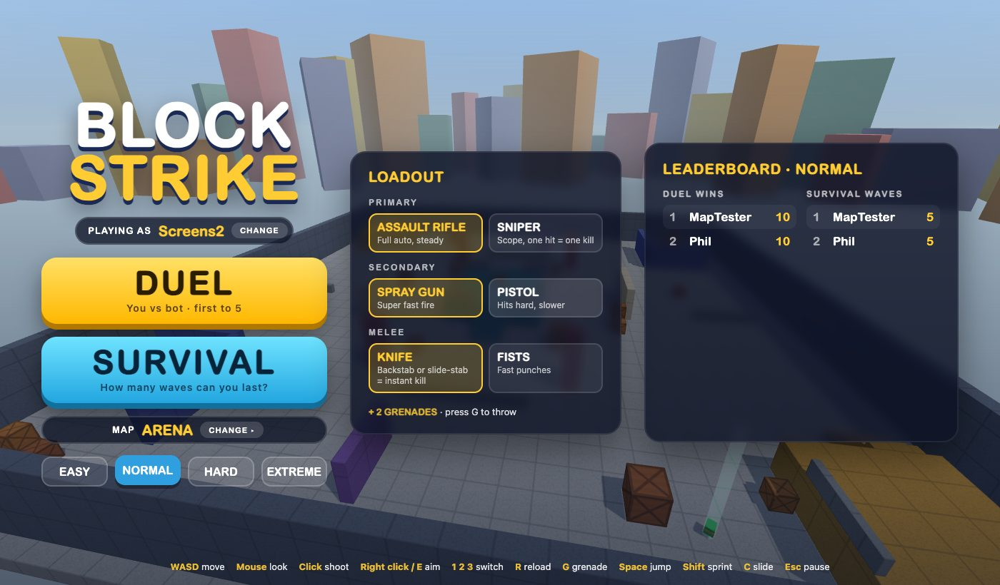
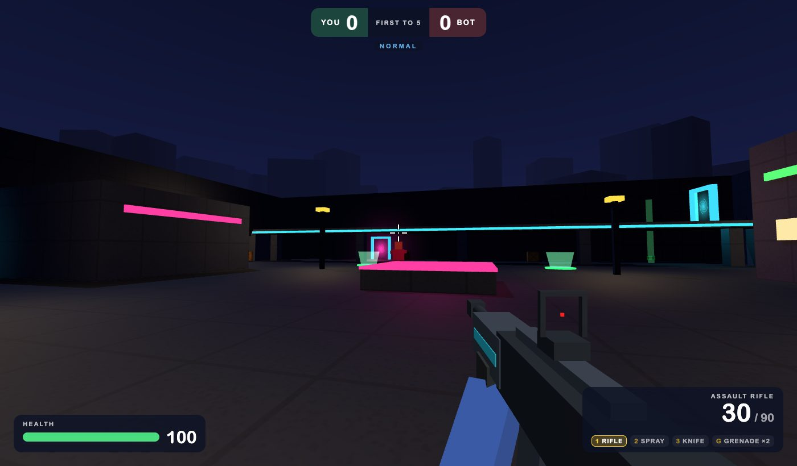

# Block Strike

A blocky first-person shooter you play in the browser. **Play it at https://blockstrike.netlify.app** on a laptop or desktop with a keyboard and mouse.

## The game

- **Duel:** you against a bot, first to 5 eliminations.
- **Survival:** one life. Wave 1 sends one bot, wave 2 sends two, and so on.
- **Four difficulties**, from Easy to Extreme, where bots snipe, switch weapons, throw grenades and backstab.
- **Loadout:** assault rifle or sniper, spray gun or pistol, knife or fists, plus two grenades. A knife in the back, or while sliding, is an instant elimination.
- **Seven maps**, unlocked by playing, each adding something new: jump pads, teleporters, power-ups, a night map.
- **Online leaderboard:** total duel wins and best survival wave, for each difficulty.

## Controls

WASD move · Mouse look · Click shoot · Right click (hold) or E (toggle) aim · 1 2 3 or scroll switch weapon · R reload · G grenade · Space jump · Shift sprint · C slide · Esc pause

## How it was built

In about four hours, by describing it to Claude Code (Claude Opus 5.5). Every prompt is in [SOURCE-CODE.md](SOURCE-CODE.md), word for word. For how the code is organised, see [AGENTS.md](AGENTS.md).
