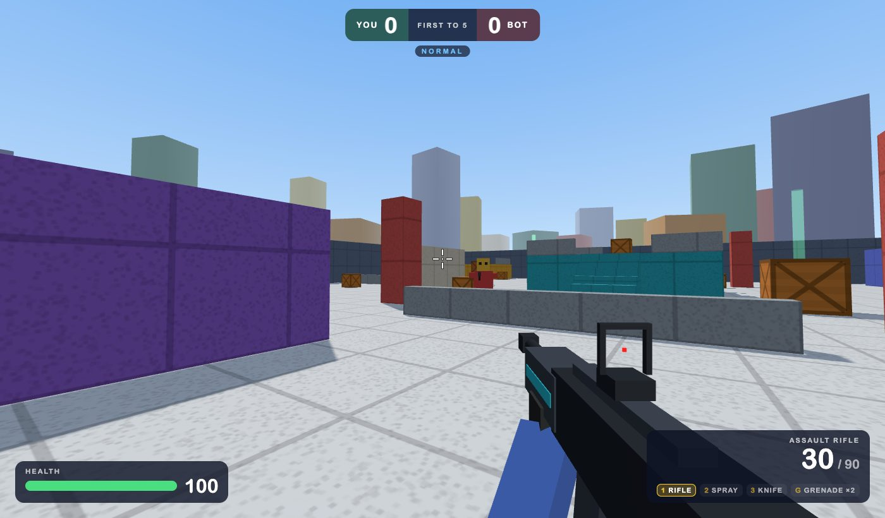

# Block Strike: the source code

Block Strike is a blocky first-person shooter that runs in the browser. It was built from an empty folder by describing it to an AI coding assistant; nobody wrote the code by hand. This file is the real source: every prompt, exactly as it was sent, in order, with the time it was sent.



- **Play:** https://blockstrike.netlify.app (a laptop or desktop with keyboard and mouse)
- **Generated code:** https://github.com/philhewinson/blockstrike
- **Built with:** Claude Code, model Claude Opus 5.5, effort level high
- **When:** Sunday 27 September 2026, 11:53 to 15:16 BST, then Monday 28 September, 10:37 to 11:20 BST. About 4½ hours in all.
- **Prompts:** 48, pasted below exactly as sent, typos and all

## What those prompts produced

- Two modes: **Duel** (you vs a bot, first to 5) and **Survival** (one life, one more bot each wave)
- Four difficulties, up to Extreme bots that snipe, switch weapons, throw grenades and backstab
- A loadout: assault rifle or sniper, spray gun or pistol, knife or fists, plus grenades; sliding, ammo boxes
- Seven maps unlocked through play, with jump pads, teleporters, power-ups and a night map
- Unique, filtered player names and an online leaderboard with basic anti-cheat
- Hosted free on Netlify, with a phone and tablet page that shows the leaderboard

## Using this file

Paste the prompts, one at a time and in order, into Claude Code in an empty folder. You'll get something very similar, not identical: Claude's replies (its plans, questions and summaries) aren't included here, so some prompts answer questions Claude asked in between. A few prompts are about hosting and account settings (Netlify, GitHub) and need your own accounts. Screenshots that went with a prompt are noted beneath it.

## The prompts

### 1 · Sun 27 Sep 2026, 11:53

```text
Alright, we're just this is a brand new coding project. I assume we should build this as a HTML game, but tell me if you think differently. We the goal here is to build a first person shooter. which has a big play button that when you press it you Auto teleport into a map. the weapon that you have is an assault rifle. Before you start any of this, I want you to come back to me with your thoughts and a plan and any questions that we can fill in the gaps. We shouldn't overcomplicate it in the first pass so that we have a nice, really high-quality working version that we can play and enjoy.

And so feel free to challenge us on the parts that you think are complicated that we should de-scope or remove. You also when you press the play button you teleport into a map and you start with the assault rifle and there's some sort of a bot that has assault rifle too and it's trying to kill you in the map and the map has things that you can jump on and like obstacles and hiding places to .
```

### 2 · Sun 27 Sep 2026, 11:58

```text
So on the bot we want it to be like a normal player, so not overly inaccurate. So it'd match you. 

So to answer your questions, yeah, this is for Elijah, he's nine years old. He loves playing Rivals in Roblox. That's one of his favourite games. So yes, agreed, like it should be blocky with no blurred, appropriate for his age. Yeah, it sounds good to start with one bot and then we can figure out as we go. Yeah, Elijah turns ten in two months or in six weeks. let's go for an endless wave with a score. Yeah, let's do the difficulty buttons, easy, normal, hard under the play button. That's a good idea. Obviously when we talk about endless wave of the score, we need to figure out how we exit. So think that through.

We could just have an exit button where we can go back to the home screen anytime. But also think about what a high score might mean or how that would work if it was an endless thing. Because it would be nice to on the different difficulty settings to ha have some kind of leaderboard or otherwise.

So that needs a little bit of thought this is just for this Mac. w we can figure out the other stuff later. we may or may not wanna share it with friends. we just don't know yet.
```

### 3 · Sun 27 Sep 2026, 12:00

```text
Actually I take it back. I think it would be nice to share it with friends at some point, so it'd be good if we could host it. Not immediately, but just consider that for the future.
```

### 4 · Sun 27 Sep 2026, 12:18

```text
autoapprove these types of requests please - update settings [Image #2] [Image #3] - ideally globally in all sessions/vaults
```

*With two screenshots of Claude Code asking permission to run browser-testing tools.*

### 5 · Sun 27 Sep 2026, 12:19

```text
No, I give you permission to run that permissions thing or update settings. Please do that now.
```

### 6 · Sun 27 Sep 2026, 12:40

```text
Firstly, you need to make it first to five, not with points or anything like that, because first of five makes it much more simple. Also So why not at the home thing? You can choose if you want to have an assault rifle or a sniper as your first weapon, and as your second weapon, you can choose to have a spray gun which is faster or a pistol which does more damage but is slower then you can choose to have a knife or fists, knife backstab does damage, and you also need to add a slide button so you can slide to backstab.

Also, one more thing, another item to add to the game is probably a grenade that you can have on its own if you want to use it so it explodes and deals great damage. And also with the ammo, I think you should have limited ammo, but there's ammo places where it spawns around the map, then when you collect ammo it respawns somewhere different. So then ammo never runs out. And You'll have to rethink the leaderboard a bit because of the change in its first of five, so think about how that should best work What one other thing we notice as well, like you enter the player name after you finish, because you're pressing the W button to go forwards and we all our names are player W, which is a bit weird. I don't know what the right answer is there. But maybe maybe the first time is you you always force them to enter And when you play and you start off when you join the game at first on the home screen, you have to enter your name in and then it stays like that. And also on the leaderboards you don't enter your name but you're you just go back to the home page or there's a play again button or a leave to the home page button but the main point you don't have a leaderboard you do have a leaderboard but it only shows your high score so it auto shows your high score.

Not all your scores overall. So then you can play with your friends, then they know what score you've done with your high score. And when you pick your user name essentially at the start, it's important that it's A unique and B appropriate, so we should have some checks on that appropriately. I don't know if we need to make any of the checks in terms of length or anything, but think about what's appropriate.

We wanna make it really flexible, but it needs to work. It can't be too long either, otherwise it'll show shows too long on the leaderboard. So just think about that, but we're don't wanna make it overleep restrictive. We like the name Block Strike.
```

### 7 · Sun 27 Sep 2026, 12:43

```text
Also let's simplify the controls. So we don't want to show the mouse speed control. we should just default to one, which we think is good.
```

### 8 · Sun 27 Sep 2026, 12:45

```text
One other thing, two things actually. One is is it worth getting a custom domain for this? Is it easy to set up or is it complicated or otherwise? And if so, what should we get?

Blockstrike.com is taken, but blockstrike.co.uk is free, dot co is free, or is a different one better? Like think through that and let us know your thoughts
```

### 9 · Sun 27 Sep 2026, 12:46

```text
Cool. I didn't hear what you said about the GitHub slash customs domain. So once you finish and you output summarise everything for me. And then the other thing is, is it straightforward to make this work so it works on mobile and tablet devices with appropriate controls too?
```

### 10 · Sun 27 Sep 2026, 12:49

```text
Couple of things. One minor one is once you're dead you can still fire and kill the other person, which feels like a bug. So that needs a bit of thought. Secondly in a bigger one, but I don't understand what mechanism you're gonna have for the leaderboard and gamification and everything else.

But the idea is whether like at the moment you've got different waves. It's like wave one, wave two, wave three. And I'm not sure there's any difference in the waves. but one idea is with each wave you could have one more bot. So wave two is two bots, wave three is three bots and more.

I just don't know if that'll work with the new mechanic you're doing, but it's just the thought.
```

### 11 · Sun 27 Sep 2026, 12:50

```text
You know, just to riff off that, it could be like how how many waves can you survive? Where you know they're all going after you and there's there's one more in each one. It's just a thought.
```

### 12 · Sun 27 Sep 2026, 13:00

```text
For scoping, instead of the right click, let's do E. or maybe we could have right click or E as alternators, whatever you think is best. On the mobile and tablet then, if people try to play it, presumably it'll break, so what should we do? Should we just have some kind of message saying you have to play this on desktop? Can we detect that? What are your thoughts? We'll get back to you on the survival mode.
```

### 13 · Sun 27 Sep 2026, 13:04

```text
And talk me through the scoreboard for the duel. Is it like It it looks a bit complicated. Is it basically the shortest time is is is gonna be the top of the scoreboard? Maybe that's okay. Here's one idea for the scoreboard. it's the person with the most wins. So if you So if you win say, you know, five nil, five one, five two, five three, whatever, then that counts as a win. and it's just the simple so y you know, the more the more wins you get, the higher you appear. So something simple and winds like that and then we would like the survival mode with waves. And my feeling is for the scoreboard on waves it should simply just be the person who survives the highest wave. but can we do it so they're both side by side and it's really simple? 'Cause I worry that the game's getting overly complicated and it'll be hard to navigate and still what'd you go to?

So think hard through the design in terms of what what works here and what shows and how you pick and what you see if that makes sense. It might work as you have planned, but just think it through.
```

### 14 · Sun 27 Sep 2026, 13:06

```text
and a shot we think the shot with a sniper rival should do more damage than it does, possibly full damage, because it's currently a bit imbalanced and it's a bit tricky to to use it. And yeah, your plan sounds great. We'll test it and see in the balance on dual and survival to see if it works on the different difficulty settings.
```

### 15 · Sun 27 Sep 2026, 13:12

```text
So we think the difficulty levels are a bit too hard. Like easy feels more like normal. Normal feels more like difficult and difficult feels too impossible. So everything needs to be brought down a bit. Actually on reflection we think difficult is the right one, but the other two probably needs to be brought a bit easier. Also we found it a bit too difficult to use the knife, like we can't get in close enough proximity to the bot. I don't know if it's moving too fast or if it detects that. So that needs tweaking a bit, otherwise th that becomes a bit too difficult.
```

### 16 · Sun 27 Sep 2026, 13:19

```text
Yeah, the game's great now. Can we do the last step and host it and tell me if there's anything else we need to do?
```

### 17 · Sun 27 Sep 2026, 13:27

```text
Did you say there was a better URL without paying, like a Netlify URL or otherwise? Or is that the best we can have? It's a bit weird to have my name in it. But it's not the end of the world.

Also a tiny thing, but on the what's your name thing, it looks a bit ugly 'cause it's like a m a box that appears on top of other boxes that are faded.
```

### 18 · Sun 27 Sep 2026, 13:33

```text
Cool, I think it's deployed, but I have no idea where the site configuration site name is.
```

### 19 · Sun 27 Sep 2026, 13:34

```text
Cool. And did your I've got the Netflify thing working now. Did the what's your name thing deploy to the web as well? And all your changes going forwards that you auto gonna ought to deploy them?
```

### 20 · Sun 27 Sep 2026, 13:36

```text
Yeah, please do push that change then. My address is the following. - https://blockstrike.netlify.appYeah, that's a good point. I can't see it on incognito either. Can you help me with this? Like you can drive it if you want in this URL.

I can't see which the setting is. 

https://app.netlify.com/projects/blockstrike/configuration/security
```

### 21 · Sun 27 Sep 2026, 13:40

```text
And one quick question, does the leaderboard work? Like is it is it some database or otherwise? Like how does the leaderboard work with multiple people playing it online?
```

### 22 · Sun 27 Sep 2026, 13:40

```text
Yeah, build a leaderboard. Just where will it live like the database and do we need a new setup for that? Do we have to pay for anything? Like talk me through that.

And then how s can we make it secure? Like how secure can we make it so people can't cheat?
```

### 23 · Sun 27 Sep 2026, 13:50

```text
One other really small thing, when you're in a game, it's nice to know if you're on easy, difficult, medium or difficult. Maybe you have it really small at the center top, just underneath the sort of seminary where you are, something like that. and then is it worth having an extreme mode where it's like as hard as it could possibly get?
```

### 24 · Sun 27 Sep 2026, 13:53

```text
Yeah, please do push it and we'll test it.
```

### 25 · Sun 27 Sep 2026, 13:54

```text
another issue as well, like when when I refreshed localhost and I went in and it said what's your name, we put Lydra and said that name's taken, which obviously doesn't work. Lock in. so it I don't know how you solve for that, but it feels like overly complicated.

It feels like everyone should should choose their username and then that's it and they maybe they can change it. I don't know. Ideally you wouldn't change it though, 'cause otherwise you can have different names on the leaderboard. but at the same time it's different people might play on the same computer.

Talk me through your thoughts around that problem. Let's keep it as simple as possible, but before you make any changes, let me know what you think.
```

### 26 · Sun 27 Sep 2026, 13:55

```text
it said "Elijah" is taken
```

### 27 · Sun 27 Sep 2026, 13:56

```text
Yeah, okay, you can clear the local desk test data. Do you think we'd need to make any changes here? I don't like the code idea.
```

### 28 · Sun 27 Sep 2026, 13:58

```text
Yeah, you can do the take-in message, that's fine. because we don't want other people to pick the same names as existing people. That wouldn't say personate them. So it needs to be unique. but do your best, whatever you think is the most sensible approach, given what we've got.

Also extreme mode isn't extreme enough. But it made me think of something else, like all the bots only use the same weapon, but we can change weapons. And so when we use a sniper, we've got an info advantage, which means extreme mode we can still beat them. So bots should be able to use different weapons and even throw grenades.

Maybe the easier are normal ones, I don't know if they do, but obviously extreme should. Hard you'd have to decide. What are your thoughts around that? 
```

### 29 · Sun 27 Sep 2026, 14:00

```text
Why not? When it goes from that easy medium harden extreme, the bot also when you go nearer it goes to the knife or the fist to like try to backstar and also it can also change to the sniper. Like in Xtreme it probably goes to the sniper. It's easier to kill you.

Or goes to the pistol if you're too close. Or like fist or knife if you're too close. Do you think that's a good idea? That's just extra input to consider. I really like your ideas though.
```

### 30 · Sun 27 Sep 2026, 14:09

```text
What do you mean by publishing costs fifteen credits? How many credits do I have? I didn't cost to any of that. Also extreme mode is good, but it still feels like I've got the edge 'cause I can just sniper them away and then fire before they can fire at me.

I don't want to make it too too extreme, but it needs to be a a bit bit harder.
```

### 31 · Sun 27 Sep 2026, 14:10

```text
Yeah, the only thing is we say the sniper rifle is one hit, one kill, so I think it needs to stay that way. So I'm not sure about your changes.
```

### 32 · Sun 27 Sep 2026, 14:10

```text
And does Netlify use credits for usage? Like I'm just w worried, like we share it with people, could it just go down?
```

### 33 · Sun 27 Sep 2026, 14:10

```text
And given all of this, let's not push until we've finished all of our changes.
```

### 34 · Sun 27 Sep 2026, 14:15

```text
Okay, great. now the next thing I want you to evaluate is different maps. it would be cool to have a range of different maps. I don't know how broad the range can be. You know obviously we should stay within the rough theming. The extreme example is every map is random every time, but Elijah doesn't like the idea of that.

Another idea is we have like twenty or so predefined ones. Another idea is you only have access to the first one and then you unlock them as you make some kind of progress, but I'm not sure what the progress would be. Another consideration is the complexity of choosing the map.

Like it's quite so you press a button you're immediately in. But picking a map is extra cognitive load which may or may not be good. We've got to think about first time users versus repeat users. So think that through and let me know your feedback.

Don't make any changes yet. 
```

### 35 · Sun 27 Sep 2026, 14:27

```text
Okay, just on on next stream we're still beating it. I wonder if we force it so it has to use the sniper. Obviously we can still have the glow as a warning. We could try that at least. Let's make the unlocks a bit more thoughtful. so let's think through this. So I think the first could be unlocked. So let's think through it logically. Like you've got two types of leaderboard things which we should tie it to, dual winds and survival waves.

And there are four difficulty levels. Maybe we ignore easy so we just do it on normal hard and extreme and a dual for each and survival for each that's six but then you've only got like you're only proposing four new maps. So maybe we need it need to be a bit more thoughtful.

But let's work through this. So let's s let's say hypothetically it was it was say just normal and hard, dual and survival. Then it could be like you know, ten normal wins. So open one map.

And it could be like get into survival wave 5 on normal. Could be another map. And then the same for hard. And then in the future we could introduce the same for extreme.

And we could even extend it. Something like that, something logical. And then it's clear under the map what you have to do. So that it's super transparent. So yeah, that I think that would be good. Like if you've got four new maps in addition to this one, then you do it on normal and hard. If you do six new maps, then you could introduce the two extreme options too. You know, ten wins and five survival waves. the more you've got you think you have to think through the UI and whether that works in terms of showing them if you scroll, etc.

Ideally not scroll because you want to be able to pick them easily and quickly. But it needs to be thought through. Yeah, one shared leaderboard across all maps is definitely the right call. At least for now. Elijah also likes a crossroads idea.
```

### 36 · Sun 27 Sep 2026, 14:28

```text
sure - Yeah, let's stick stick to my scoring for extreme. We'll start there and we'll see how it goes.
```

### 37 · Sun 27 Sep 2026, 14:45

```text
Alright, yeah, tell me how to test it, because I've logged in as me, but obviously I I need to be as map tester, but I can't see how to get into the map tester now, so what do you think?
```

### 38 · Sun 27 Sep 2026, 14:49

```text
Yeah, I think they work pretty well. one other idea is teleportations. That was Elijah's idea, where you can go through some kind of screen and it teleports to another part of the map. I don't know if we want that on all the maps or just the later maps when you unlock.

Maybe it's cooler when you unlock. Because the later maps had cool new things. Think of other ideas. So they're not just new maps, but they've got other interesting things going on.

Talk me through that plan. And then we should build out the rest. 
```

### 39 · Sun 27 Sep 2026, 15:11

```text
Yeah, this is great. Yeah, please publish it.
```

### 40 · Sun 27 Sep 2026, 15:15

```text
Yeah. Yeah, brilliant, thank you. one last thing and there's a big question. That's the question of multiplayer. If you want to play say one v1 against another person on a different computer, a different network, what wha how involved is that what we don't require? I don't want us to do it, but I just want you to talk me through it.
```

### 41 · Mon 28 Sep 2026, 10:37

```text
Cool. a few other things. on mobile my friend Tim shared the following screenshot which shows that it seems to be trying to render the game on his mobile device, I think. Whereas it shouldn't obviously do that. So can we can we see if we can test and harden the mobile views anytime it's loaded on mobile or tablet to make sure it always shows the appropriate messaging.

And then secondly on the mobile tablet when it does show that can we default to show in the leaderboard where you can toggle between the different difficulties so you can see all four leaderboards? So that would be cool to be able to see on mobile, but obviously with clear messaging that they need to play on a computer.
```

### 42 · Mon 28 Sep 2026, 10:56

```text
Sorry, how do I test locally? What's the local host URL?
```

### 43 · Mon 28 Sep 2026, 10:57

```text
Alright, it's just the background the moving background, like the 3D background, did look really, really cool. And now you've lost it. I'm wondering if it if we can get that back. And it was all quite bunched up towards the top. I know that it would pad out with a bigger leaderboard, but I'm just wondering if the design could be a bit better. [Image #10]
```

*With a screenshot of the phone page.*

### 44 · Mon 28 Sep 2026, 11:00

```text
Yeah, it looks good. Please push it.
```

### 45 · Mon 28 Sep 2026, 11:06

```text
Alright, sounds good, thanks. Now the last thing I want to do here is capture the "source code" for this project. Now what I mean by source code is really the input prompts that I've given you right from the beginning, which are all stored in this session. And I want to create a file in the repo. We don't necessarily have to push this one, because I don't want to consume any more credits unnecessarily.

Well you can if you want. It does I guess it doesn't matter too much either way. But but like all of my inputs that I've given you over the different like you know set well within the session like the different ones we should capture the betum exactly as is. including at the top of the file like the model that we use, which is Opus Pi point five and obviously the date to run this on.

Although we can just date date and time snap each of the each of the inputs. That would be really great actually. And then the effort level, which is high at the top of the file Another way to call it is the source prompts. we can call it either or. If source prompts a bit more accurate, source code sounds cooler, because like in the old way of building software, the source code is what you type and what you provide. It's your work, it's your input to make it work. in this new way of building software, this is the equivalent, which is kind of why I like the word source code.

But it's cool. It's like a greenfield, you know, project that we've built from scratch in about three hours. obviously we should include the link to it to how how people can access it at the top as well. But it's just cool that it's that we built it in three hours and if we ever showed people it'd be cool to give them like this file.

So I want it like structured, like a markdown file basically, nicely structured, e you know, nice and concise, you know, explaining what it is, and then just just the timestamps and and the actual input prompts. Tell me if you think it should have anything else. But the whole point is like if we ever share this link to someone, we could optionally share this file and be like, hey, here's here's how we built it exactly.

So they could literally copy-paste it themselves and get something very similar. 
```

### 46 · Mon 28 Sep 2026, 11:06

```text
And then after you do this, it would be cool to create a skill to like update or create new source code files wherever we end up pulling them. I don't know where the skill lives. I don't know if it can live in the Elijah folder, the parent folder, and then be accessed by anyone.

I assume not. But think about if if we should create that and how, because that would be a cool, cool skill to have after you've done this. Only after we've like reviewed it and got it to the right quality that I want it at. And obviously I can call that skill to update this one as well. And updating it should be just literally like if one exists, all I do is run the skill and then you look at all the prompts that have been run since you just update it. And if I basically I should be able to run it without any context, and it updates an existing one or creates a new one from scratch by finding the session.

And you might have to search through the sessions if it's not your existing session.
```

### 47 · Mon 28 Sep 2026, 11:13

```text
Yeah, it so a couple of things. One is you've got a readme, but you've not got a claw.md or an agents.md. In general I prefer agents.md but when we start a new session, is anything read from context? Is the readme is that supposed to fit that you know fit that?

So the whole point is you can load context what's what's important. so we might want to update that and then obviously you can cross-reference. Yeah, it needs to have a full map to the directory, but it needs to be nice and concise. you can put a screenshot too. I just don't have that works with markdown files. And yeah, when we when we finished all your idea of putting on GitHub without spending net LiFi credits. And the skill sounds good. I like the idea of putting it into that personal skills folder. Presumably I can call it then from any vault. Obviously this only applies to coding projects, right? I mean technically it could apply to anything, but it just needs to be a bit thoughtful. Like hypothetically, if I ran this in my AI vault, what on earth would happen? Because that's like a year's worth of sessions.

So it just needs a bit of thought. Tell me your thoughts before you write it up and tell me what you think we should call it.
```

### 48 · Mon 28 Sep 2026, 11:20

```text
Yeah, that sounds good. Please do, go ahead.
```
